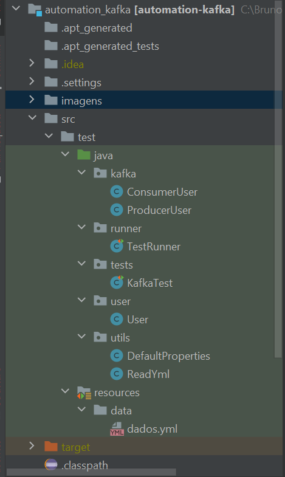
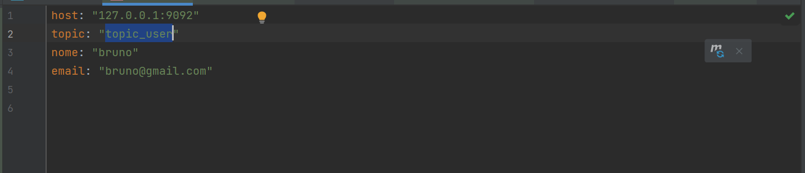
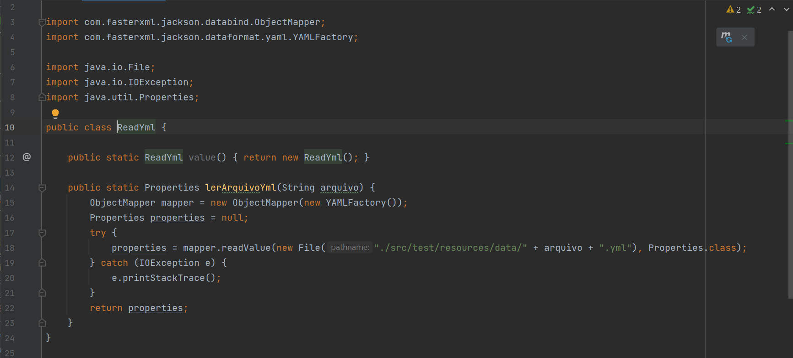
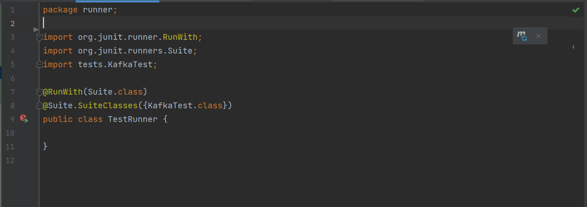
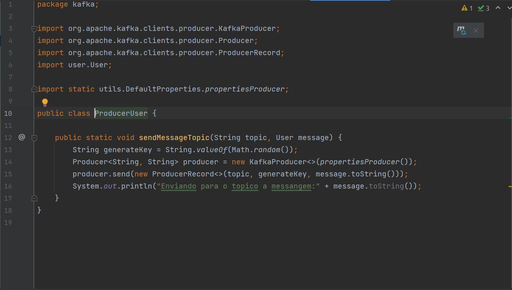
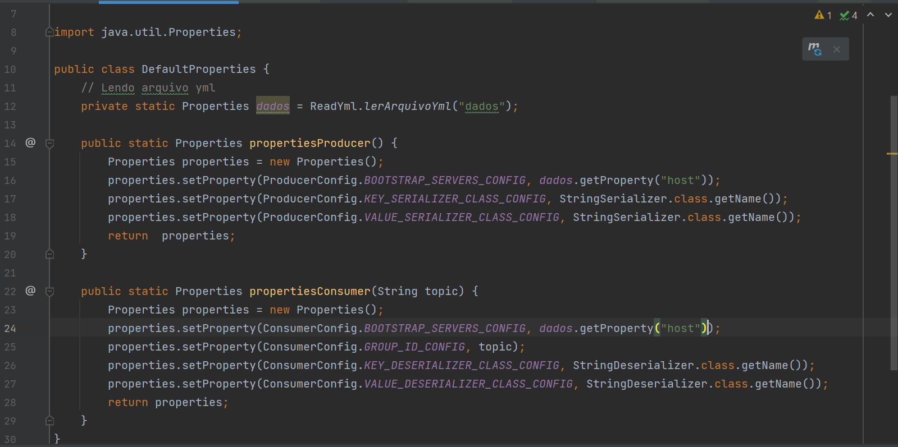
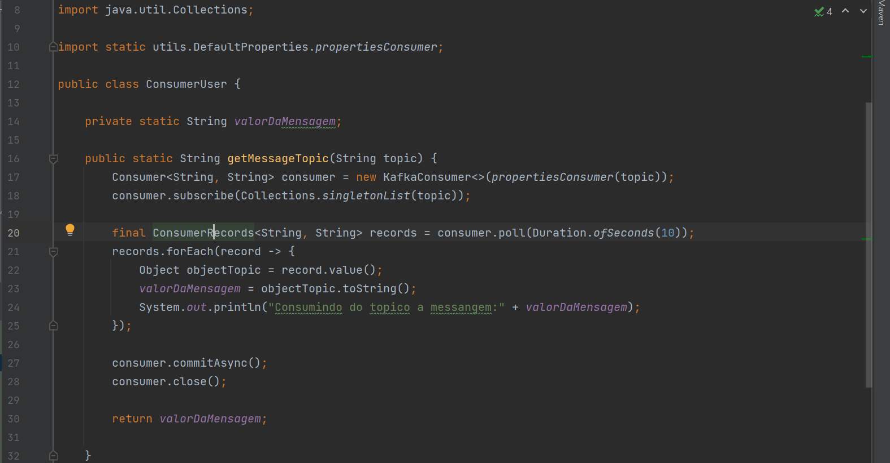
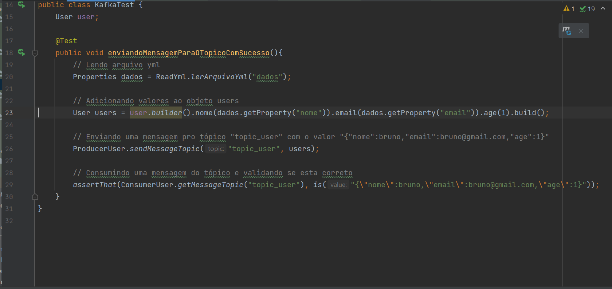
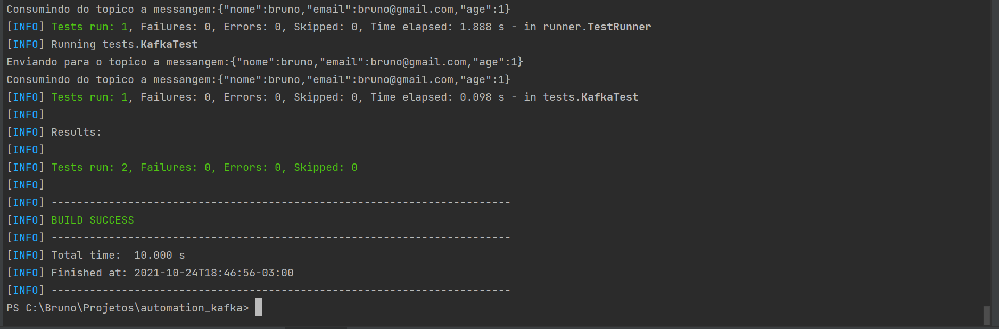

# Automação com kafka + Java

## Sumário

- [Boas vindas ao repositório do projeto de Testes automatizados com kafka](#boas-vindas-ao-repositório-do-projeto-de-testes-automatizados-de-kafka)
- [1. O que é o Apache Kafka?](#1-o-que-é-o-apache-kafka)
  - [1.1 Primeira coisa vamos falar sobre streaming.](#11-primeira-coisa-vamos-falar-sobre-streaming)
  - [1.2 Para que posso usar o streaming de eventos?](#12-para-que-posso-usar-o-streaming-de-eventos)
  - [1.3 Apache Kafka® é uma plataforma de streaming de eventos. O que isso significa?](#13-apache-kafka-é-uma-plataforma-de-streaming-de-eventos-o-que-isso-significa)
  - [1.4 Como funciona o kafka ](#14-como-funciona-o-kafka)
- [2. O que é o Zookeper](#2-o-que-é-o-zookeper)
- [3. O que é um Tópico](#3-o-que-é-um-tópico)
- [4. Configurando o Ambiente](#4-configurando-o-ambiente)
  - [4.1 Instalar o Kafka](#41-instalar-o-kafka)
  - [4.2 Instalar o Zookepeer](#42-instalar-o-zookepeer)
  - [4.3 Aqui fica sua preferência como executar o kafka e zookeper local ou via docker](#43-aqui-fica-sua-preferência-como-executar-o-kafka-e-zookeper-local-ou-via-docker)
     - [4.3.1 Rodando o Kafka e Zookeeper local via terminal](#431-rodando-o-kafka-e-zookeeper-local-via-terminal)
        - [4.3.1.1 Criando um Tópico via comando](#4311-criando-um-tópico-via-comando)
        - [4.3.1.2 Listando Tópicos via comando](#4312-listando-tópicos-via-comando)
        - [4.3.1.3 Produzindo mensagem para um Tópico via comando](#4313-produzindo-mensagem-para-um-tópico-via-comando)
        - [4.3.1.4 Consumindo um Tópico via comando](#4314-consumindo-um-tópico-via-comando)
     - [4.3.2 Rodando o Kafka e Zookeeper via docker-compose](#432-rodando-o-kafka-e-zookeeper-via-docker-compose)
         - [4.3.2.1 Criando um Tópico via docker-compose](#4321-criando-um-tópico-via-comando-docker-compose)
         - [4.3.2.2 Listando Tópicos via docker-compose](#4323-listando-tópicos-via-docker-compose)
         - [4.3.2.4 Consumindo um Tópico via docker-compose](#4323-consumindo-um-tópico-via-docker-compose)
- [5. Configurando o projeto de automação](#5-configurando-o-projeto-de-automação)
  - [5.1. Rodando kafka e zookeeper no docker](#51-rodando-kafka-e-zookeeper-no-docker)
  - [5.2. Configurando o projeto](#52-configurando-o-projeto)
    - [5.2.1 Instalando o plugin do lombok](#521-instalando-o-plugin-do-lombok)
    - [5.2.2 Instalando o projeto](#522-instalando-o-projeto)
    - [5.2.3 Estrutura do projeto](#523-estrutura-do-projeto)
- [6. Em breve falo sobre avro e projetos com avro + kafka](#6-em-breve-falo-sobre-avro-e-projetos-com-avro--kafka)
- [7. Referências](#7-referências)
---

### Boas vindas ao repositório do projeto de testes automatizados de kafka.

- Esse repositório foi criado para auxiliar a fazer testes automatizados de streaming de eventos com kafka.

### 1. O que é o Apache Kafka?

### 1.1 Primeira coisa vamos falar sobre streaming.

O streaming de eventos é o equivalente digital do sistema nervoso central do corpo humano. É a base tecnológica para 
o mundo "sempre ativo", onde as empresas são cada vez mais definidas e automatizadas por software e onde o usuário de 
software é mais software.

Tecnicamente falando, o streaming de eventos é a prática de capturar dados em tempo real de fontes de eventos como 
bancos de dados, sensores, dispositivos móveis, serviços em nuvem e aplicativos de software na forma de fluxos de 
eventos; armazenar esses fluxos de eventos de forma durável para recuperação posterior; manipular, processar e reagir 
aos fluxos de eventos em tempo real e também retrospectivamente; e encaminhar os fluxos de eventos para diferentes 
tecnologias de destino, conforme necessário. 

O streaming de eventos, portanto, garante um fluxo contínuo e interpretação dos dados para que as informações certas 
estejam no lugar certo, na hora certa.

### 1.2 Para que posso usar o streaming de eventos?

O streaming de eventos é aplicado a uma ampla variedade de casos de uso em uma infinidade de setores e organizações. 

 #### Seus muitos exemplos incluem:

- Para processar pagamentos e transações financeiras em tempo real, como em bolsas de valores, bancos e seguros.
- Para rastrear e monitorar carros, caminhões, frotas e remessas em tempo real, como na logística e na indústria automotiva.
- Para capturar e analisar continuamente os dados do sensor de dispositivos IoT ou outros equipamentos, como fábricas e parques eólicos.
- Para coletar e reagir imediatamente às interações e pedidos do cliente, como no varejo, no setor de hotéis e viagens e em aplicativos móveis.
- Para monitorar pacientes em cuidados hospitalares e prever mudanças nas condições para garantir o tratamento oportuno em emergências.
- Conectar, armazenar e disponibilizar dados produzidos por diferentes divisões de uma empresa.
- Para servir como base para plataformas de dados, arquiteturas orientadas a eventos e microsserviços.

### 1.3 Apache Kafka® é uma plataforma de streaming de eventos. O que isso significa?

O Kafka combina três recursos principais para que você possa implementar seus casos de uso para streaming de eventos de 
ponta a ponta com uma única solução testada em batalha:

  1) Para publicar (gravar) e assinar (ler) fluxos de eventos, incluindo importação / exportação contínua de seus dados de outros sistemas.
  2) Para armazenar streams de eventos de forma durável e confiável pelo tempo que você quiser.
  3) Para processar fluxos de eventos conforme eles ocorrem ou retrospectivamente.

  E toda essa funcionalidade é fornecida de maneira distribuída, altamente escalável, elástica, tolerante a falhas e 
  segura. O Kafka pode ser implantado em hardware máquinas virtuais e contêineres, e no local, bem como na nuvem. 
  Você pode escolher entre o autogerenciamento de seus ambientes Kafka e o uso de serviços totalmente gerenciados 
  oferecidos por diversos fornecedores.

### 1.4 Como funciona o kafka 

Kafka é um sistema distribuído que consiste em servidores e clientes que se comunicam por meio de um protocolo de rede 
TCP de alto desempenho . Ele pode ser implantado em hardware bare-metal, máquinas virtuais e contêineres no local, 
bem como em ambientes de nuvem.

**Servidores:** O Kafka é executado como um cluster de um ou mais servidores que podem abranger vários datacenters ou 
regiões de nuvem. Alguns desses servidores formam a camada de armazenamento, chamados de corretores. Outros servidores 
executam o Kafka Connect para importar e exportar dados continuamente como fluxos de eventos para integrar o Kafka com 
seus sistemas existentes, como bancos de dados relacionais, bem como outros clusters Kafka. Para permitir que você 
implemente casos de uso de missão crítica, um cluster Kafka é altamente escalonável e tolerante a falhas: se algum de 
seus servidores falhar, os outros servidores assumirão seu trabalho para garantir operações contínuas sem qualquer perda de dados.

**Clientes:** Eles permitem que você escreva aplicativos e microsserviços distribuídos que leem, gravam e processam 
fluxos de eventos em paralelo, em escala e de maneira tolerante a falhas, mesmo no caso de problemas de rede ou 
de máquina. O Kafka vem com alguns desses clientes incluídos, que são aumentados por dezenas de clientes fornecidos pela comunidade 
Kafka: os clientes estão disponíveis para Java e Scala, incluindo a biblioteca Kafka Streams de nível superior , 
para Go, Python, C / C ++ e muitas outras programações linguagens, bem como APIs REST.

### 2. O que é o Zookeper?

ZooKeeper é um serviço centralizado para manter informações de configuração, nomenclatura, fornecer sincronização 
distribuída e fornecer serviços de grupo. Todos esses tipos de serviços são usados de uma forma ou de outra por 
aplicativos distribuídos. Cada vez que eles são implementados, há muito trabalho para consertar os bugs e as condições 
de corrida que são inevitáveis. Devido à dificuldade de implementar esses tipos de serviços, os aplicativos geralmente 
os reduzem, o que os torna frágeis na presença de mudanças e difíceis de gerenciar. Mesmo quando feito corretamente, 
diferentes implementações desses serviços levam à complexidade do gerenciamento quando os aplicativos são implantados.

Saiba mais sobre o ZooKeeper no [ZooKeeper Wiki](https://cwiki.apache.org/confluence/display/ZOOKEEPER/Index) .

### 3. O que é um Tópico.

Os eventos são organizados e armazenados de forma duradoura em tópicos . Muito simplificado, um tópico é semelhante a 
uma pasta em um sistema de arquivos, e os eventos são os arquivos dessa pasta. Um exemplo de nome de tópico poderia 
ser "pagamentos". Os tópicos no Kafka são sempre multiprodutor e multi-assinante: um tópico pode ter zero, um ou muitos
produtores que gravam eventos nele, bem como zero, um ou muitos consumidores que assinam esses eventos. Os eventos em 
um tópico podem ser lidos com a frequência necessária - ao contrário dos sistemas de mensagens tradicionais, os eventos 
não são excluídos após o consumo. Em vez disso, você define por quanto tempo o Kafka deve reter seus eventos por meio de
uma definição de configuração por tópico, após o qual os eventos antigos serão descartados. O desempenho do Kafka é 
efetivamente constante em relação ao tamanho dos dados, portanto, armazenar dados por um longo tempo é perfeitamente 
adequado.

Os tópicos são particionados , o que significa que um tópico é espalhado por vários "depósitos" localizados em 
diferentes corretores Kafka. Esse posicionamento distribuído de seus dados é muito importante para a escalabilidade, 
pois permite que os aplicativos clientes leiam e gravem os dados de / para vários corretores ao mesmo tempo. 
Quando um novo evento é publicado em um tópico, ele é, na verdade, anexado a uma das partições do tópico. 
Eventos com a mesma chave de evento (por exemplo, um cliente ou ID de veículo) são gravados na mesma partição, 
e Kafka garante que qualquer consumidor de uma determinada partição de tópico sempre lerá os eventos dessa partição 
exatamente na mesma ordem em que foram gravados.


**Figura:** Este tópico de exemplo tem quatro partições P1 – P4. Dois clientes produtores diferentes estão publicando, 
independentemente um do outro, novos eventos no tópico, gravando eventos na rede nas partições do tópico. 
Eventos com a mesma chave (denotados por suas cores na figura) são gravados na mesma partição. Observe que ambos os 
produtores podem gravar na mesma partição, se apropriado.

Para tornar seus dados tolerantes a falhas e altamente disponíveis, todos os tópicos podem ser replicados ,
mesmo em regiões geográficas ou datacenters, para que sempre haja vários corretores que tenham uma cópia dos dados, 
caso algo dê errado, você deseja fazer manutenção nos corretores e assim por diante. Uma configuração de produção comum 
é um fator de replicação de 3, ou seja, sempre haverá três cópias de seus dados. Essa replicação é realizada no nível 
das partições de tópico.

### 4. Configurando o ambiente.

### 4.1 Instalar o Kafka

Link para baixar o [Kafka](https://kafka.apache.org/downloads)

Depois disso você pode descompactar em qualquer pasta `No meu caso eu descompactei na pasta C:`

### 4.2 Instalar o Zookepeer

Link para baixar o [Zookepeer](http://zookeeper.apache.org/releases.html)

Depois disso você pode descompactar em qualquer pasta `No meu caso eu descompactei na pasta C:`

### 4.3 Aqui fica sua preferência como executar o kafka e zookeper local ou via docker

Aqui te dou a escolha de usar o kafka e zookeeper na sua máquina ou usando via docker-compose.

### 4.3.1 Rodando o Kafka e Zookeeper local via terminal

### Rodando o kafka na sua maquina MAC/linux

- Acessar a pasta `seucaminho/kafka.2.12-2.3.1/bin/`
- 
**OBS:** fique atento com a versão que vc baixou 

- Depois Executar o comando:
```
kafka-server-start.sh config/server.properties
```

### Rodando o kafka na sua maquina windows:

- Acessar a a pasta `C://kafka.2.12-2.3.1/bin/windows`.

**OBS:** fique atento com a versão que vc baixou

- Executar o comando:

```
kafka-server-start.bat  C:\kafka_2.12-2.3.1\config\server.properties
```

###  Rodando o zookeper na sua maquina windows

- Acessar a a pasta `seucaminho/kafka.2.12-2.3.1/bin/bin/`.

**OBS:** fique atento com a versão que vc baixou

- Executar o comando:

```
zookeeper-server-start.sh config\zookeeper.properties
```

###  Rodando o zookeper na sua máquina windows

- Acessar a a pasta `C://kafka.2.12-2.3.1/bin/windows`.

**OBS:** fique atento com a versão que vc baixou

- Executar o comando:

```
zookeeper-server-start.bat  C:\kafka_2.12-2.3.1\config\zookeeper.properties
```

### 4.3.1.1 Criando um Tópico via comando

### Criando um tópico no Windows

```
kafka-topics.bat --create --bootstrap-server localhost:9092 --replication-factor 1 --partitions 1 --topic NOME_DO_TOPICO
```

### Criando um tópico no Mac/linux

```
kafka-topics.sh --create --bootstrap-server localhost:9092 --replication-factor 1 --partitions 1 --topic NOME_DO_TOPICO
```

### 4.3.1.2 Listando Tópicos via comando

### Listando um tópico no Windows

```
kafka-topics.bat --list --bootstrap-server localhost:9092
```

### Listando um tópico no Mac/linux

```
kafka-topics.sh --list --bootstrap-server localhost:9092
```

### 4.3.1.3 Produzindo mensagem para um Tópico via comando

### Produzindo uma mensagem em um tópico no Windows

```
kafka-console-producer.bat --broker-list localhost:9092 --topic NOME_DO_TOPICO
```

**OBS:** Após rodar esse comando cada texto que vc digitar no terminal e apertar enter será uma mensagem do tópico

### Produzindo uma mensagem em um tópico no Mac/linux

```
kafka-console-producer.sh --broker-list localhost:9092 --topic NOME_DO_TOPICO
```

**OBS:** Após rodar esse comando cada texto que vc digitar no terminal e apertar enter será uma mensagem do tópico

### 4.3.1.4 Consumindo um Tópico via comando

### Consumindo um tópico no Windows

```
kafka-console-consumer.bat --bootstrap-server localhost:9092 --topic NOME_DO_TOPICO --from-beginning
```

### Consumindo um tópico no Mac/linux

```
kafka-console-consumer.sh --bootstrap-server localhost:9092 --topic NOME_DO_TOPICO --from-beginning
```

### 4.3.2 Rodando o Kafka e Zookeeper via docker-compose

Neste passo e preciso ter o docker na máquina sugiro que siga as instruções deste link [Docker](https://docs.docker.com/get-docker/)

No nosso projeto existe um arquivo `docker-compose.yml` na pasta raiz, basta acessar o terminal e rodar os comandos abaixo

### 4.3.2.1 Criando um Tópico via comando docker-compose

```
docker exec kafka kafka-topics --create --if-not-exists --zookeeper zookeeper:2181 --partitions 1 --replication-factor 1 --topic NOME_DO_TOPICO
```

### 4.3.2.3 Listando Tópicos via docker-compose

```
docker-compose exec kafka kafka-topics --list --bootstrap-server localhost:9092
```

### 4.3.2.3 Consumindo um Tópico via docker-compose

```
docker-compose exec kafka kafka-console-consumer --bootstrap-server localhost:29092 --topic NOME_DO_TOPICO --from-beginning
```

### 5. Configurando o projeto de automação

Para o nosso projeto de automação vamos usar o docker-compose para subir o kafka e o zookeeper para ficar mais facil 
para nossa automação.

### 5.1. Rodando kafka e zookeeper no docker:

- No projeto tem um arquivo chamado `docker-compose.yml` que já vai subir uma imagem do kafka e do zookeeper, onde o kafka vai estar na porta `9092` e o zookeeper vai estar na porta `2181`.
- Basta executar o comando no terminal:

```
docker-compose up
```

- Isso irá subir a imagem com o kafka e zookeeper com um tópico chamado `topic_user`.
- Caso queira derrubar o docker basta executar o comando:

```
docker-compose down
```

**OBS: PODE ACONTECER DE SEU WINDOWS NÃO CONTER O WSL2 ENTÃO É PRECISO INSTALAR ELE NO POWERSHELL COM O COMANDO:**

 - Baixar o wsl neste link [WSL2](Pacote de atualização do kernel do Linux do WSL2 para computadores x64)
 - Depois executar esse comando no powershell:

```
wsl --set-default-version 2
```

Para subir um tópico dentro do docker basta executar esse comando

```
docker-compose exec kafka kafka-topics --create --if-not-exists --zookeeper zookeeper:2181
 --partitions 1 --replication-factor 1 --topic topic_user 
```

**OBS:** o docker já cria um tópico chamado `topic_user` caso queira criar outro basta executar esse comando acima

Você tambem verá umas variáveis no docker-compose se quiser saber para que cada uma funcione acesse esse link da documentação:

https://docs.confluent.io/platform/current/installation/docker/config-reference.html

**OBS: A variável `KAFKA_CREATE_TOPICS: 'topic_user'` é usada para criar o tópico ao subir a imagem, pelo fato de se 
você não criar o tópico antes os seus testes iram falhar pelo motivo de não ter tópico, então quando você manda um 
producer sem o tópico criado ele irá criar um baseado no seu producer, sendo assim o primeiro teste não funcionaria, então 
fique sempre atento com essa situação.**

### 5.2. Configurando o projeto:

Antes de rodar o projeto e necessário ter:

 - Java 11
 - Maven
 - Kafka(Caso você não queira usar o docker-compose)
 - Zookeeper(Caso você não queira usar o docker-compose)
 - E o plugin do lombok

### 5.2.1 Instalando o plugin do lombok

- Configurando o lombok no eclipse:

https://dicasdejava.com.br/como-configurar-o-lombok-no-eclipse/

- Configurando o lombok no intellij:

https://dicasdejava.com.br/como-configurar-o-lombok-no-intellij-idea/

### 5.2.2 Instalando o projeto

- Basta executar o comando abaixo:

```
mvn clean install
```

Isso irá baixar todas as dependências necessárias para o projeto funcionar que são:

- **kafka-clients** - É usado para criar os producers e os consumers.
- **junit** - É usado para rodar os testes automatizados.
- **javafaker** - É usado para gerar dados aleatórios.
- **lombok** - É um plugin usado para gerar anotações para encurtar um pouco o codificação de objetos java.
- **hamcrest-all** - É usado para fazer asserções dos testes.
- **jackson-dataformat-yaml** - É uma ferramenta para formatar arquivos yml.

**OBS: Essas ferramentas/plugins fazem mais coisas, porém nesse nosso contexto irei utilizar com esse sentido explicado acima**


### 5.2.3 Estrutura do projeto



Nosso projeto consiste em:

 - kafka - onde contém as classes onde criamos os produces e consumers.
 - runner - Suite de teste onde irá rodar todos os testes.
 - tests - Onde contém as classes que contém os testes.
 - user - Classe onde tem o objeto `User`.
 - utils - Onde algumas classes com funções de ler arquivos yaml e Configurações do kafka.
 - resources/data - Onde contém massa de dados para nossos testes.

Então vamos falar do nosso projeto agora como ele funciona

### resoruces/data



Esse arquivo yml é o mais simples ele contem apenas as massas de dados que iremos usar no projeto

### ReadYml



Para a gente ler o arquivo yml criei esse método que vai percorrer por todo yml e para pegar os valores basta pegar 
usando o comando:

```
dados.getProperty("email")
```

### Runner



Este é o arquivo onde contem algumas configurações da suite de testes e qual classe de teste ele vai rodar no nosso caso
acima ele vai rodar a classe KafkaTest.

### Producer



  - Aqui é onde fazemos a instância do producer passando suas [propriedades](#defaultproperties) e depois enviando uma mensagem passando o nome 
do tópico uma chave aleatoria e a mensagem que queremos enviar.
  
### DefaultProperties



Aqui é onde configuro o as propriedades de para cada um deles um especifico para o producer e outro especifico para o consumer

### Consumer
 


 - Aqui basicamente eu instâncio um consumer passando as [propriedades](#defaultproperties) e depois disso percorro pela
lista gerada pelo topico e pego a mensagem e valido depois comito o evento e retorno a resposta.
 
### Tests



Aqui é onde temos nossos testes de fato onde eu leio o arquivo yml para pegar os dados depois instâncio a classe user 
passando os parâmetros nome, email e idade depois envio uma mensagem para o tópico chamado topic_user e depois faco a 
validação que o kafka me retorna

### Rodando o projeto

 - Basta executar o comando no terminal:

```
mvn clean test
```



### 6. Em breve falo sobre avro e projetos com avro + kafka

Em Breve...

Explicar o que é avro

Passos da configuracao
1adicionar o plugins apache avro IDL
2adicionado a biblioteca do avro e o plugins do maven avro
3configurei o plugins do avro para pegar o arquivo da pasta 
4e gerar o modelo na pasta tal
5editei o arquivo avsc(explicar masi detalhado sobre o que cada campo faz)
6executar e mostrar o que o avro gera o arquivo com a classe baseada no avro
7inputar valor na classe mostrar como faz
8Fazer um producer com avro
9fazer um consumer com avro
10fazer um teste com avro

explicar o que e o Confluent Control Center
Mostar com configura um Confluent Control Center(uma forma visual de ver como ta a fila, msg etc)


### 7. Referências

### Kafka

https://www.confluent.io/

https://kafka.apache.org/intro

https://kafka.apache.org/21/documentation.html

https://kafka.apache.org/21/documentation.html#consumerconfigs

### Zookeeper

https://zookeeper.apache.org/

https://cwiki.apache.org/confluence/display/ZOOKEEPER/Index

### Docker

https://docs.docker.com/get-docker/

### Lombok

https://projectlombok.org/

### Java 

https://www.java.com/pt-BR/

### Maven

https://maven.apache.org/
